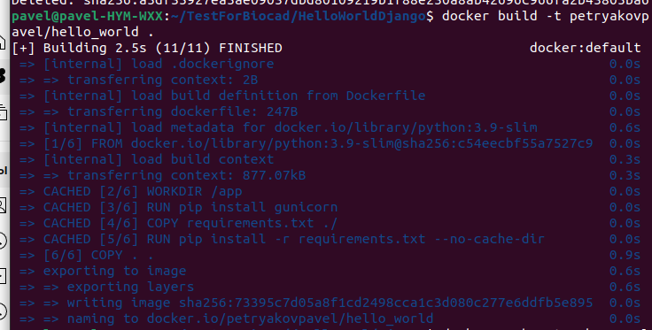

# Тестовое задание на должность стажера DevOps
## Создаем приложение, собираем образ и загружаем на DockerHub
Создаем веб-приложение "Hello world!" на фреймворке Django .Создаем Dockerfile .
```
FROM python:3.9-slim
WORKDIR /app
RUN pip install gunicorn
COPY requirements.txt ./
RUN pip install -r requirements.txt --no-cache-dir
COPY . .
CMD ["gunicorn", "--bind", "0.0.0.0:32777", "web_project.wsgi"]
```

 Собраный образ  загружаем на DockerHub

```
docker build -t niktimo/hello_world_django hello/
docker push niktimo/hello_world_django
```

### Запуск Minikube, создание demployment с двумя репликами
Запуск minikube cluster с драйвером docker
```
minikube start --driver docker
```


Создадим deployment на основе манифеста. В манифесте указываем образ для контейнера, количество реплик - 2, и значение порта контейнера. После создания проверяем наличие деплоймента и двух реплик контейнера.
```
kubectl apply -f manifests/test_deployment.yml
kubectl get deploy
kubectl get pod
```


Содержание манифеста:
```
apiVersion: apps/v1
kind: Deployment
metadata:
  name: hello-world-deployment
  labels:
    app: hello-world
spec:
  replicas: 2
  selector:
    matchLabels:
      app: hello-world
  template:
    metadata:
      labels:
        app: hello-world
    spec:
      containers:
      - name: hello-world
        image: niktimo/hello_world_django
        ports:
        - containerPort: 32777
```
### Создание сервиса для доступа
Созданные deploy расширяем с помощью сервиса NodePort. После расширения проверяем наличие сервиса. Вывод в формате Yaml сохраняем в файл service.yml.
```
kubectl expose deploy/hello-world-deployment --name=hello-world-service --type=NodePort --port=32777 --target-port=32777 -o yaml > manifests/service.yml
kubectl get service
```


Содержание манифеста сервиса:
```
apiVersion: v1
kind: Service
metadata:
  creationTimestamp: "2023-11-12T16:27:24Z"
  labels:
    app: hello-world
  name: hello-world-service
  namespace: default
  resourceVersion: "12217"
  uid: 3fb374d2-93c9-47ad-9a95-5a29b0e69af7
spec:
  clusterIP: 10.106.44.255
  clusterIPs:
  - 10.106.44.255
  externalTrafficPolicy: Cluster
  internalTrafficPolicy: Cluster
  ipFamilies:
  - IPv4
  ipFamilyPolicy: SingleStack
  ports:
  - nodePort: 30228
    port: 32777
    protocol: TCP
    targetPort: 32777
  selector:
    app: hello-world
  sessionAffinity: None
  type: NodePort
status:
  loadBalancer: {}

```
### Запуск проброса портов и проверка результата
```
kubectl port-forward service/hello-world-service 32777
```


Как видно выше приложение достпуно по адресу [http://localhost:32777/](http://localhost:32777/)
### Схема

